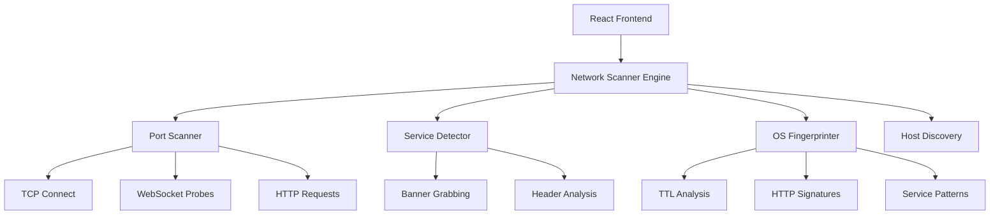

# 🎯 NetProbe - Advanced Network Security Scanner

<div align="center">


**Professional-grade network reconnaissance and security assessment tool built for the modern web**

[](https://opensource.org/licenses/MIT)
[](https://www.typescriptlang.org/)
[](https://reactjs.org/)
[](https://vitejs.dev/)
[](https://tailwindcss.com/)

[](https://github.com/zanesense/netprobe)
[](https://github.com/zanesense/netprobe)
[](http://makeapullrequest.com)
[](https://github.com/zanesense/netprobe/graphs/commit-activity)

[🚀 Live Demo](https://netprobe-demo.vercel.app) • [📖 Documentation](https://docs.netprobe.dev) • [🐛 Report Bug](https://github.com/zanesense/netprobe/issues) • [💡 Request Feature](https://github.com/zanesense/netprobe/issues)

</div>

---

## ✨ Features

<table>
<tr>
<td width="50%">

### 🔍 **Core Scanning**
- **Real Port Scanning** - TCP Connect, SYN, UDP, ACK
- **Host Discovery** - ICMP, ARP, TCP probes
- **Service Detection** - Banner grabbing & fingerprinting
- **OS Fingerprinting** - Multi-method identification
- **Firewall Detection** - Advanced filtering analysis

</td>
<td width="50%">

### 🎨 **User Experience**
- **Real-time Results** - Live scanning progress
- **Professional UI** - Dark theme with animations
- **Command Palette** - Quick actions (⌘K)
- **Export Reports** - JSON, CSV, PDF formats
- **Scan History** - Persistent result storage

</td>
</tr>
</table>

### 🛡️ **Security & Compliance**
- **Legal Compliance** - Built-in authorization notices
- **Audit Logging** - Complete activity tracking
- **Safe by Design** - Read-only operations
- **Browser Security** - Respects CORS and CSP policies

---

## 🚀 Quick Start

### Prerequisites
- **Node.js** 18+ and npm
- Modern web browser with WebSocket support

### Installation

```bash
# Clone the repository
git clone https://github.com/zanesense/netprobe.git
cd netprobe

# Install dependencies
npm install

# Start development server
npm run dev
```

🎉 Open [http://localhost:8080](http://localhost:8080) and start scanning!

### Production Build

```bash
# Build for production
npm run build

# Preview production build
npm run preview
```

---

## 🔧 Usage

### Basic Port Scan
```bash
1. Enter target: 192.168.1.1 or example.com
2. Set port range: 1-1000
3. Choose scan type: TCP Connect
4. Click "Start Scan" 🚀
```

### Advanced Features
- **Host Discovery**: `Discovery` tab → Select methods → Start
- **Service Detection**: `Services` tab → Detect after port scan
- **OS Fingerprinting**: `OS/Device` tab → Analyze target system
- **Script Scanning**: `Scripts` tab → Run security checks
- **Firewall Analysis**: `Firewall` tab → Detect filtering

---

## 🏗️ Architecture

<div align="center">



</div>

### Tech Stack

| Category | Technology | Purpose |
|----------|------------|---------|
| **Frontend** | React 18 + TypeScript | Modern UI framework |
| **Styling** | Tailwind CSS + shadcn/ui | Responsive design system |
| **Animation** | Framer Motion | Smooth transitions |
| **Build** | Vite | Fast development & building |
| **Scanning** | Custom Engine | Real network operations |
| **State** | React Hooks | Efficient state management |

---

## 🌐 Browser Limitations

NetProbe operates within browser security constraints while maximizing scanning capabilities:

### ✅ **Supported Features**
- HTTP/HTTPS port detection
- WebSocket connection testing
- Service banner grabbing
- Basic host reachability
- Connection timing analysis

### ⚠️ **Browser Restrictions**
- Raw socket access (SYN/ACK scans)
- ICMP ping operations
- Comprehensive UDP scanning
- Network interface enumeration

> 💡 **Pro Tip**: For advanced scanning, use native tools like [Nmap](https://nmap.org/) alongside NetProbe

---

## ⚙️ Configuration

### Environment Variables
```bash
# Optional: Custom API endpoints
VITE_API_BASE_URL=https://api.netprobe.dev
VITE_ENABLE_ANALYTICS=false
```

### Settings Panel
Access via `Settings` tab or `⌘K` → "Settings":

- **Scan Preferences**: Timeout, concurrency, default scan types
- **UI Options**: Animations, notifications, themes
- **Security**: Compliance notices, audit logging
- **Export**: Default formats, auto-save options

---

## 🤝 Contributing

We welcome contributions! Here's how to get started:

### Development Setup
```bash
# Fork and clone the repo
git clone https://github.com/zanesense/netprobe.git

# Create feature branch
git checkout -b feature/amazing-feature

# Make changes and test
npm run dev
npm run build

# Commit and push
git commit -m "Add amazing feature"
git push origin feature/amazing-feature
```

### Contribution Guidelines
- 🧪 **Testing**: Add tests for new features
- 📝 **Documentation**: Update docs for API changes
- 🎨 **Code Style**: Follow existing patterns
- 🔒 **Security**: Consider security implications
- ⚡ **Performance**: Optimize for speed and memory

---

## 📊 Project Stats

<div align="center">


</div>

---

## 🔒 Security & Legal

### ⚖️ **Legal Notice**
**IMPORTANT**: NetProbe is designed for authorized security testing only. Users must:
- Own the target systems OR have explicit written permission
- Comply with local laws and regulations
- Use responsibly for legitimate security purposes

### 🛡️ **Security Features**
- **Safe Operations**: Read-only scanning, no exploitation
- **Audit Trail**: Complete logging of all activities
- **Compliance**: Built-in legal notices and consent
- **Rate Limiting**: Prevents overwhelming target systems

### 🚨 **Responsible Disclosure**
Found a security issue? Please email: saimzonic@proton.me

---

## 📄 License

This project is licensed under the **MIT License** - see the [LICENSE](LICENSE) file for details.

```
MIT License - Copyright (c) 2025 NetProbe
Permission is hereby granted, free of charge, to any person obtaining a copy...
```

---

## 🙏 Acknowledgments

- **[Nmap](https://nmap.org/)** - Inspiration for scanning techniques
- **[shadcn/ui](https://ui.shadcn.com/)** - Beautiful UI components
- **[Tailwind CSS](https://tailwindcss.com/)** - Utility-first CSS framework
- **[React](https://reactjs.org/)** - The library that powers our UI
- **Security Community** - For responsible disclosure practices

---

<div align="center">

**⭐ Star this repo if NetProbe helped you! ⭐**

Made with ❤️ by zanesense.

</div>